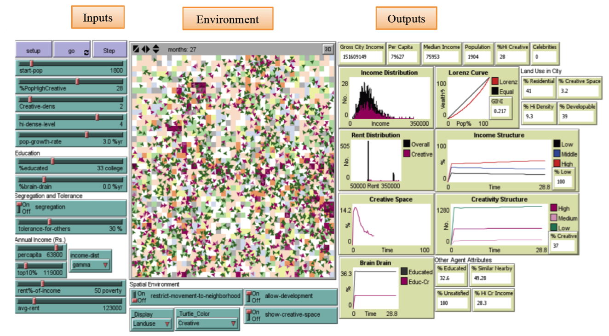
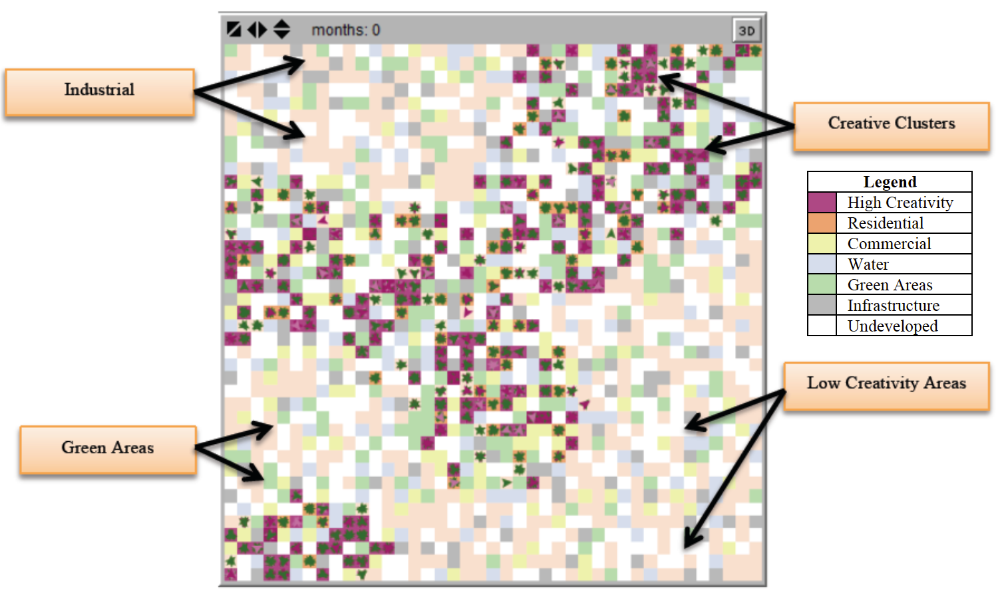

# Creative City: An agent-based model which explores the creativity and urban development.

Within this repository you will find additional information about our agent-based model which explores the creativity and urban development:

* For a detailed Overview, Design concepts, and Details (ODD) protocol of our model see [ODD.pdf](ODD.pdf)
* The Original Model (created in NetLogo 5.0.3) see [Creative_City_NetLogoV5_0_3.nlogo](Creative_City_NetLogoV5_0_3.nlogo)
* Updated Model (NetLogo 6.1.0) see [Creative_City_NetLogoV6_1.nlogo](Creative_City_NetLogoV6_1.nlogo)

Click on the image below to see a short movie (<https://youtu.be/3z01Q34vtKo>) of a simulation run:

## References relating to this work

* **Malik, A.A., Crooks, A.T., Root, H.L. and Swartz, M.** (2015), Exploring Creativity and Urban Development through Agent-Based Modeling, Journal of Artificial Societies and Social Simulation. 18 (2): 12. Available at <http://jasss.soc.surrey.ac.uk/18/2/12.html>. 
* **Malik, A.A., Crooks, A.T. and Root, H.L.** (2013), Can Pakistan have Creative Cities? An Agent Based Modeling Approach with Preliminary Application to Karachi. Pakistan Strategy Support Program Working Paper 13, International Food Policy Research Institute (IFPRI), Washington, DC. [(pdf)](https://www.dropbox.com/s/i43sryb1szgvj8o/pss.pdf?dl=0)
* **Malik, A., Swartz, M., Crooks, A.T. and Root, H.** (2013), Agent-Based Modeling Simulations for Solving Pakistan’s Urban Challenge, SWARMFEST 2013: 17th Annual Swarmfest Conference, 8th-9th July, Orlando, FL. [(pdf)](https://www.dropbox.com/s/u45j5z0i76aex2u/SWARMFEST.pdf?dl=0)

